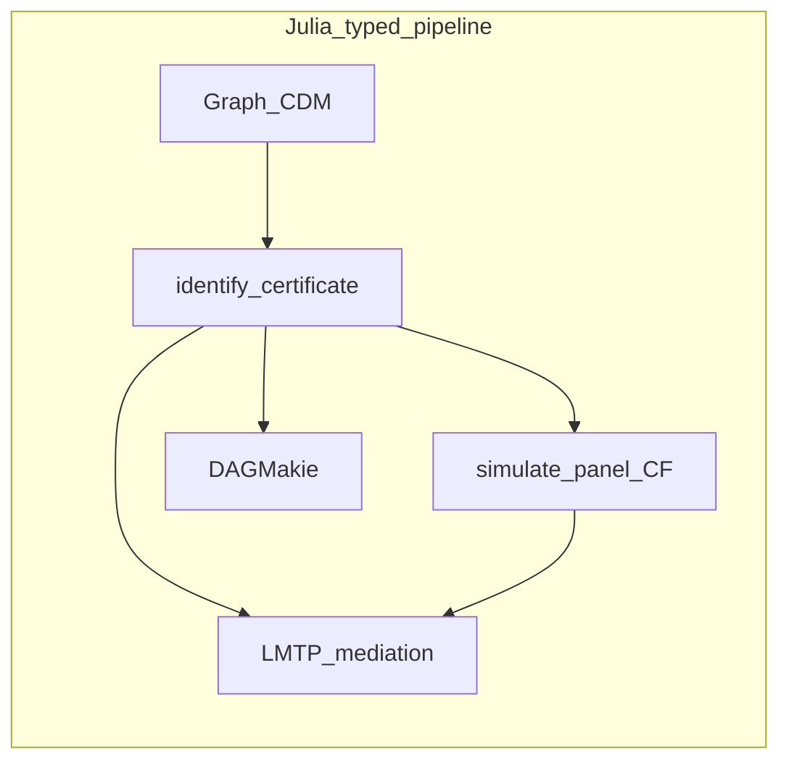

# Julia causal stack vs R and Python

**Canonical copy in the CDCS monorepo:** this file under `packages/`.
Owned packages keep identical copies for standalone GitHub links; sync with
`julia --project=. --threads=auto scripts/sync_shared_package_docs.jl`.

This note compares the owned Julia packages
([CausalDynamics.jl](https://github.com/SimonAB/CausalDynamics.jl),
[CausalTargeted.jl](https://github.com/SimonAB/CausalTargeted.jl),
[CausalMediation.jl](https://github.com/SimonAB/CausalMediation.jl),
[DAGMakie.jl](https://github.com/SimonAB/DAGMakie.jl)) with the R and Python
tools people most often reach for. Analogues are **conceptual parity**, not
line-for-line ports.

The distinctive claim is **integration**: one typed pipeline from graph
identification through dynamical simulation and targeted estimation to Makie
figures, without RCall or PyCall on the hot path. Individual pieces exist
elsewhere; the composable certificate chain is what is hard to assemble in
typical R or Python workflows.

Discrete-time hand-off: `simulate_panel` → wide `CDMPanel` / `DataFrame` →
`sequential_spec_from_identification` / `plan_sequential` → `execute_estimand`
(`SequentialPolicy`). Point-treatment LMTP and mediation keep the existing
tabular certificate bridges.

## Typical routes by ecosystem

| Step | Julia (this stack) | Typical R | Typical Python |
|------|--------------------|-----------|----------------|
| Graph → identify | CausalDynamics (`IdentificationResult`) | [dagitty](https://cran.r-project.org/package=dagitty), [ggdag](https://cran.r-project.org/package=ggdag) | [DoWhy](https://github.com/py-why/dowhy), [causal-learn](https://github.com/py-why/causal-learn) |
| Simulate SCM / CDM | CausalDynamics (+ optional SciML) | Fragmented (`simcausal`, custom) | DoWhy SCM; custom SciPy |
| Estimate LMTP / mediation | CausalTargeted + CausalMediation | [lmtp](https://cran.r-project.org/package=lmtp), [crumble](https://cran.r-project.org/package=crumble), tmle3 | [Ananke](https://github.com/UH-CAnD3/ananke); DoubleML (related, not LMTP) |
| Plot DAG / SWIG | DAGMakie | ggdag, dagitty plot | networkx + matplotlib, graphviz, CausalGraphicalModels |
| Shared typed object | Designed in | Rare | Partial (DoWhy identify → estimate) |

## Legend

| Mark | Meaning |
|------|---------|
| `Yes` | First-class, documented |
| `Partial` | Possible with glue or a limited API |
| `—` | Not in that package’s usual scope |
| `Unique` | Strong differentiator for this Julia package or stack |

## Master capability matrix

| Capability | Julia stack | R analogue | Python analogue | Notes |
|------------|-------------|------------|-----------------|-------|
| d-separation / backdoor / frontdoor / IV | Yes (CausalDynamics) | Yes (dagitty) | Yes (DoWhy / causal-learn) | |
| Typed ID certificate | Unique | Partial | Partial | `IdentificationResult` |
| Discrete-time CDM + shared-`U` CF | Unique | — / Partial | Partial | Trajectories, not only scalar outcomes |
| Observational panel from CDM | Unique | Partial | Partial | `simulate_panel` → wide table |
| Latent → observed panel bridge | Unique | Partial | Partial | `ObservationBridge` (no filter in core) |
| Temporal unroll + time-indexed ID | Unique | Partial | Partial | |
| Continuous CDM + SciML `do` | Unique | — | Partial | Same structural layer as graphs |
| Continuous MC functionals | Unique | — | Partial | `ContinuousEffectFunctional` + `g_computation` |
| Transport ID (domain in adjustment) | Yes | Partial | Partial | `TransportQuery` |
| Policy choice over estimands | Yes (CausalTargeted) | Partial | Partial | `choose_policy` |
| LMTP / MTP δ-grids | Yes (CausalTargeted) | Yes (lmtp) | Yes (Ananke) | Conceptual parity |
| Categorical-treatment LMTP | Yes (CausalTargeted) | Yes (lmtp) | Partial | T=1 `run_discrete_lmtp`; multi-time `SequentialPolicy` `policies` (classification ratios; mixed A rejected) |
| Sequential LMTP from temporal ID + panel | Unique | Partial | Partial | `plan_sequential` / `execute_estimand`; numeric shift or factor `policies`; `estimand_from_query` keeps `LongitudinalPolicy` unless `policies`+`treatments` |
| Discrete-time survival / event-time LMTP | Thin | Yes | Partial | `SurvivalPolicy` / `run_survival_lmtp` (CR deferred) |
| Interventional mediation (TE/NDE/NIE) | Yes (CausalMediation) | Yes (crumble / tmle3) | Partial (Ananke) | Numeric MTP or factor recode (continuous `M`; empty `moc` on the factor path) |
| Intermediate confounding (`moc`) + continuous MTP EIF | Yes (CausalMediation) | Yes (crumble / medoutcon) | Partial | |
| Recanting-twin / path-specific + target-trial API | Unique (CausalMediation) | Partial (crumble RT / medRCT) | — | Typed ID + EIF in one pipeline |
| Consumes upstream ID certificate | Unique | Partial | Partial | `plan_mtp` / `plan_mediation` / `plan_sequential` / `execute_estimand` |
| Layered causal DAG + bidirected | Yes (DAGMakie) | Yes (ggdag) | Partial | |
| Time-indexed / SWIG / DiD grammar | Unique | Partial (custom ggplot) | Partial (custom) | |
| Same Makie stack as SciML figures | Unique | — | — | Publication pipeline |

## Decision card

**Choose this Julia stack when** you want identification, dynamical simulation
(optional SciML), targeted LMTP/mediation, and causal figures to share types and
certificates in one language.

**Prefer R or Python when** you need a mature GUI (e.g. dagitty web), a specific
CRAN/PyPI option not yet mirrored here, or an existing team codebase that already
owns the glue between packages.

## Per-package pages

- [CausalDynamics comparison](https://simonab.github.io/CausalDynamics.jl/dev/comparison/)
- [CausalTargeted comparison](https://simonab.github.io/CausalTargeted.jl/dev/comparison/)
- [CausalMediation comparison](https://simonab.github.io/CausalMediation.jl/dev/comparison/)
- [DAGMakie comparison](https://simonab.github.io/DAGMakie.jl/dev/comparison/)

Narrative companion: [CDCS book](https://simonab.github.io/causal-dynamics-book/).
