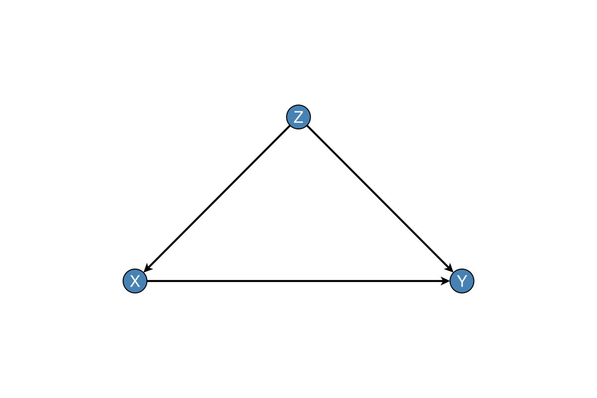

# DAGMakie.jl

[](https://github.com/SimonAB/DAGMakie.jl/actions/workflows/CI.yml)
[](https://SimonAB.github.io/DAGMakie.jl/dev/)
[](https://codecov.io/gh/SimonAB/DAGMakie.jl)
[](https://github.com/JuliaTesting/Aqua.jl)
[](https://opensource.org/licenses/MIT)

> ⚠️ **Work in Progress** — This package is under active development and not yet registered.

Publication-ready visualisation of Directed Acyclic Graphs (DAGs) for causal inference.

DAGMakie provides clean, minimal DAG visualisation with sensible defaults for academic papers and presentations. It builds on [GraphMakie.jl](https://github.com/MakieOrg/GraphMakie.jl) with features specifically designed for causal diagrams.

## Features

- **Automatic label alignment**: Labels positioned to avoid edge overlaps
- **Publication-ready themes**: Clean styling with no axes or grids
- **Causal diagram conventions**: Support for observed, latent, treatment, and outcome nodes
- **Common patterns**: Convenience functions for chain, fork, collider, confounding DAGs
- **Style presets**: Default, minimal, bold, and presentation styles

## Installation

Since this package is not yet registered, install from the local path:

```julia
using Pkg
Pkg.develop(path="/path/to/DAGMakie.jl")
```

## Quick Start

```julia
using Graphs, DAGMakie, CairoMakie

# Create a simple confounding DAG: Z → X → Y, Z → Y
g = SimpleDiGraph(3)
add_edge!(g, 1, 2)  # Z → X
add_edge!(g, 1, 3)  # Z → Y
add_edge!(g, 2, 3)  # X → Y

# Plot with labels
fig, ax, p = dagplot(g, nlabels=["Z", "X", "Y"])
save("confounding_dag.png", fig)
```



## Examples

### Basic DAG

```julia
using Graphs, DAGMakie, CairoMakie

g = SimpleDiGraph(4)
add_edge!(g, 1, 2)
add_edge!(g, 1, 3)
add_edge!(g, 2, 4)
add_edge!(g, 3, 4)

fig, ax, p = dagplot(g, 
    nlabels = ["A", "B", "C", "D"],
    node_color = :lightblue
)
```

### With Node Type Styling

```julia
# Highlight treatment and outcome
fig, ax, p = dagplot(g,
    nlabels = ["Confounder", "Treatment", "Outcome"],
    node_color = [:yellow, :lightgreen, :lightblue]
)
```

### Multiple DAGs

```julia
fig = Figure(size = (1200, 400))

ax1 = Axis(fig[1, 1], title = "Chain")
ax2 = Axis(fig[1, 2], title = "Fork")
ax3 = Axis(fig[1, 3], title = "Collider")

g_chain, _ = chain_graph(["A", "B", "C"])
g_fork, _ = fork_graph(["A", "B", "C"])
g_collider, _ = collider_graph(["A", "B", "C"])

dagplot!(ax1, g_chain, nlabels = ["A", "B", "C"])
dagplot!(ax2, g_fork, nlabels = ["A", "B", "C"])
dagplot!(ax3, g_collider, nlabels = ["A", "B", "C"])

save("dag_patterns.png", fig)
```

### Convenience Functions

```julia
# Common causal patterns with one function call
fig, ax, p = dagplot_chain(["X₁", "X₂", "X₃"])
fig, ax, p = dagplot_fork(["Effect₁", "Cause", "Effect₂"])
fig, ax, p = dagplot_collider(["Cause₁", "Effect", "Cause₂"])
fig, ax, p = dagplot_confounding(["Confounder", "Treatment", "Outcome"])
fig, ax, p = dagplot_mediation(["Treatment", "Mediator", "Outcome"])
```

### Using DAGSpec for Complex Graphs

```julia
g = SimpleDiGraph(4)
add_edge!(g, 1, 2)
add_edge!(g, 1, 3)
add_edge!(g, 2, 4)
add_edge!(g, 3, 4)

spec = DAGSpec(g,
    node_labels = ["Instrument", "Treatment", "Confounder", "Outcome"],
    node_types = [Instrument, Treatment, Confounder, Outcome]
)

fig, ax, p = dagplot(spec)
```

### Bidirected Edges (Unmeasured Confounding)

```julia
using DAGMakie, CairoMakie

# Create a mixed graph with bidirected edge (X ↔ Y = unmeasured confounder)
mg = mixed_graph(3, 
    [(1, 2), (2, 3)],  # Directed: Z → X → Y
    [(2, 3)]           # Bidirected: X ↔ Y
)
fig, ax, p = dagplot(mg, nlabels=["Z", "X", "Y"])

# Or use convenience function
fig, ax, p = dagplot_iv_confounded(["Instrument", "Treatment", "Outcome"])

# Customise bidirected edge appearance
fig, ax, p = dagplot(mg,
    nlabels = ["Z", "X", "Y"],
    bidirected_color = :red,
    bidirected_style = :dot,
    bidirected_curvature = 0.4
)
```

### d-Separation and Backdoor Paths

```julia
# Create a confounded DAG: Z → X → Y, Z → Y
g, labels = confounding_graph(["Z", "X", "Y"])

# Test d-separation
is_d_separated(g, 2, 3, Set{Int}())  # false - X and Y connected via Z
is_d_separated(g, 2, 3, Set([1]))    # true - conditioning on Z blocks the path

# Find backdoor paths from X to Y
backdoor = find_backdoor_paths(g, 2, 3)

# Check if adjustment set is valid
is_valid_adjustment_set(g, 2, 3, Set([1]))  # true - Z blocks backdoor

# Find minimal adjustment set
adj = find_minimal_adjustment_set(g, 2, 3)  # returns Set([1])
```

### Path Highlighting Visualisation

```julia
# Visualise backdoor paths (open paths in red, blocked in grey)
fig, ax, p = dagplot_backdoor(g, 2, 3, nlabels=labels)

# With adjustment set - shows paths are blocked
fig, ax, p = dagplot_backdoor(g, 2, 3, 
    adjustment = Set([1]),
    nlabels = labels
)

# Visualise d-separation status
fig, ax, p = dagplot_dsep(g, 1, 3, Set([2]), nlabels=labels)

# Show causal (directed) paths
fig, ax, p = dagplot_causal_paths(g, 2, 3, nlabels=labels)

# Auto-compute and show adjustment set
fig, ax, p = dagplot_adjustment(g, 2, 3, nlabels=labels)
```

### Interventions (do-operator)

```julia
# Graph surgery: remove incoming edges to intervention target
g, labels = confounding_graph(["Z", "X", "Y"])
g_do = do_surgery(g, 2)  # do(X) - removes Z → X

# Visualise intervention (shows removed edges as dashed)
int = Intervention(2; label="do(X)")
fig, ax, p = dagplot_intervention(g, int, nlabels=labels)

# Convenience function
fig, ax, p = dagplot_do(g, 2, nlabels=labels)

# Side-by-side comparison: original vs post-intervention
fig = dagplot_do_comparison(g, 2, nlabels=labels)

# Check if causal effect is identifiable
causal_effect_identifiable(g, 2, 3)  # true if backdoor criterion satisfied

# Check if intervention removes confounding
intervention_removes_confounding(g, 2, 3)  # true

# Identify confounders
confounders = identify_confounders(g, 2, 3)  # returns [1] (Z)
```

### CausalDynamics.jl Integration

```julia
using DAGMakie, CausalDynamics, CairoMakie, Graphs

# Create an SCM
g = DiGraph(3)
add_edge!(g, 1, 2)  # Z → X
add_edge!(g, 2, 3)  # X → Y
add_edge!(g, 1, 3)  # Z → Y

scm = GraphSCM(g, Dict{Int,Function}(), Set{Int}())

# Plot the SCM directly
fig, ax, p = dagplot(scm, nlabels=["Z", "X", "Y"])

# Use CausalDynamics' d-separation
CausalDynamics.d_separated(g, 2, 3, [1])  # true

# Get the extension module for advanced functions
ext = Base.get_extension(DAGMakie, :DAGMakieCausalDynamicsExt)

# Comprehensive causal analysis
analysis = ext.causal_analysis(g, 2, 3)
# Returns: (backdoor_paths, adjustment_set, identifiable, d_separated_unconditional)

# Print formatted analysis report
ext.print_causal_analysis(g, 2, 3, nlabels=["Z", "X", "Y"])

# Plot with CausalDynamics-computed adjustment
fig, ax, p = ext.dagplot_adjustment_cd(g, 2, 3, nlabels=["Z", "X", "Y"])

# Visualise SCM with exogenous variables highlighted
scm_with_exog = GraphSCM(g, Dict{Int,Function}(), Set([1]))  # Z is exogenous
fig, ax, p = ext.dagplot_scm(scm_with_exog, nlabels=["Z", "X", "Y"], show_exogenous=true)
```

### Style Presets

```julia
# Different styles for different contexts
style = default_style()       # Standard academic paper
style = minimal_style()       # Thin lines, small nodes
style = bold_style()          # Thick lines, large nodes
style = presentation_style()  # Extra large for slides
```

## API Reference

### Main Functions

| Function | Description |
|----------|-------------|
| `dagplot(g; kwargs...)` | Create new figure with DAG |
| `dagplot!(ax, g; kwargs...)` | Plot DAG into existing axis |
| `dagplot(spec::DAGSpec; kwargs...)` | Plot from specification |

### Keyword Arguments

#### Layout
- `layout = Spring()` — Layout algorithm from NetworkLayout.jl
- `padding = 0.1` — Padding around graph (fraction of range)

#### Nodes
- `node_size = 12` — Node size in pixels
- `node_color = :lightblue` — Fill colour
- `node_strokewidth = 1.0` — Outline width
- `node_strokecolor = :black` — Outline colour

#### Edges
- `edge_color = :black` — Edge colour
- `edge_width = 1.0` — Edge line width
- `arrow_size = 10` — Arrowhead size
- `arrow_shift = :end` — Arrow position

#### Labels
- `nlabels = nothing` — Node labels (vector of strings)
- `nlabels_align = (:right, :bottom)` — Label alignment
- `auto_align_labels = true` — Automatic alignment to avoid edges
- `nlabels_distance = 10` — Distance from node (pixels)
- `nlabels_fontsize = 14` — Font size
- `nlabels_color = :black` — Label colour

### Convenience Functions

| Function | Pattern |
|----------|---------|
| `dagplot_chain(labels)` | X₁ → X₂ → ... → Xₙ |
| `dagplot_fork(labels)` | X ← Y → Z |
| `dagplot_collider(labels)` | X → Y ← Z |
| `dagplot_confounding(labels)` | Z → X → Y, Z → Y |
| `dagplot_mediation(labels)` | X → M → Y, X → Y |
| `dagplot_confounded(labels)` | X → Y with X ↔ Y |
| `dagplot_frontdoor(labels)` | X → M → Y with X ↔ Y |
| `dagplot_iv_confounded(labels)` | Z → X → Y with X ↔ Y |
| `dagplot_m_bias(labels)` | X → Y with X ↔ M ↔ Y |

### Types

| Type | Description |
|------|-------------|
| `NodeType` | Enum: `Observed`, `Latent`, `Treatment`, `Outcome`, etc. |
| `NodeSpec` | Node specification with label, type, styling |
| `EdgeType` | Enum: `Directed`, `Bidirected`, `Undirected` |
| `EdgeSpec` | Edge specification with styling |
| `DAGSpec` | Complete DAG specification |
| `MixedGraph` | Graph with both directed and bidirected edges |

### Utilities

| Function | Description |
|----------|-------------|
| `compute_auto_label_aligns(g, positions)` | Compute optimal label positions |
| `chain_graph(labels)` | Create chain graph |
| `fork_graph(labels)` | Create fork graph |
| `collider_graph(labels)` | Create collider graph |
| `confounding_graph(labels)` | Create confounding graph |
| `mixed_graph(n, directed, bidirected)` | Create mixed graph |
| `confounded_graph(labels)` | X → Y with X ↔ Y |
| `frontdoor_graph(labels)` | X → M → Y with X ↔ Y |
| `is_dag(g)` | Check if graph is acyclic |

### Causal Analysis

| Function | Description |
|----------|-------------|
| `find_all_paths(g, src, dst)` | Find all paths (any direction) |
| `find_directed_paths(g, src, dst)` | Find causal paths |
| `find_backdoor_paths(g, treatment, outcome)` | Find backdoor paths |
| `is_d_separated(g, x, y, z)` | Test d-separation |
| `is_valid_adjustment_set(g, t, o, adj)` | Check backdoor criterion |
| `find_minimal_adjustment_set(g, t, o)` | Find smallest valid adjustment |
| `list_all_adjustment_sets(g, t, o)` | List all valid adjustments |
| `ancestors(g, node)` | Find all ancestors |
| `descendants(g, node)` | Find all descendants |

### Highlighting Functions

| Function | Description |
|----------|-------------|
| `dagplot_backdoor(g, t, o)` | Show backdoor paths |
| `dagplot_dsep(g, x, y, z)` | Show d-separation status |
| `dagplot_causal_paths(g, t, o)` | Show directed paths |
| `dagplot_adjustment(g, t, o)` | Show auto-computed adjustment |
| `dagplot_highlighted(g, spec)` | Custom highlighting |

### Intervention Functions

| Function | Description |
|----------|-------------|
| `do_surgery(g, nodes)` | Remove incoming edges (graph surgery) |
| `dagplot_intervention(g, int)` | Show intervention with removed edges |
| `dagplot_do(g, node)` | Single-node intervention plot |
| `dagplot_comparison(g, int)` | Side-by-side comparison |
| `dagplot_do_comparison(g, node)` | Side-by-side for single intervention |
| `causal_effect_identifiable(g, t, o)` | Check backdoor identifiability |
| `identify_confounders(g, t, o)` | Find confounding variables |

### CausalDynamics.jl Integration

When CausalDynamics.jl is loaded, additional functions become available:

| Function | Description |
|----------|-------------|
| `dagplot(scm)` | Plot an SCM's causal graph |
| `dagplot_scm(scm)` | Plot with exogenous highlighting |
| `dagplot_dsep_cd(g, x, y, z)` | d-separation using CausalDynamics |
| `dagplot_backdoor_cd(g, t, o)` | Backdoor analysis via CausalDynamics |
| `dagplot_adjustment_cd(g, t, o)` | Show CausalDynamics adjustment set |
| `causal_analysis(g, t, o)` | Comprehensive causal analysis |
| `print_causal_analysis(g, t, o)` | Formatted analysis report |

## Roadmap

### Phase 1 ✅ (Complete)
- [x] Automatic label alignment
- [x] Publication-ready theme
- [x] Basic dagplot recipe
- [x] Common pattern convenience functions
- [x] Node type system

### Phase 2 ✅ (Complete)
- [x] Bidirected edges for unmeasured confounding (↔)
- [x] MixedGraph type for directed + bidirected edges
- [x] Visual node type styling
- [x] Convenience functions for common confounded graphs

### Phase 3 ✅ (Complete)
- [x] Path finding algorithms (all paths, directed paths, backdoor paths)
- [x] d-separation testing
- [x] Adjustment set computation (validity checking, minimal sets)
- [x] Path highlighting visualisation
- [x] Convenience functions for backdoor, d-separation, and adjustment plots

### Phase 4 ✅ (Complete)
- [x] Graph surgery for do-operator
- [x] Intervention notation (`do(X)`) rendering
- [x] Intervention visualisation (single and comparison views)
- [x] Causal effect identifiability checking
- [x] Causal query representation

### Phase 5 ✅ (Complete)
- [x] CausalDynamics.jl package extension
- [x] Direct plotting of SCM types (GraphSCM, SymbolicSCM)
- [x] Integration with CausalDynamics analysis functions
- [x] Causal analysis helpers and reporting

## Related Packages

- [GraphMakie.jl](https://github.com/MakieOrg/GraphMakie.jl) — General graph visualisation for Makie
- [CausalDynamics.jl](https://github.com/SimonAB/CausalDynamics.jl) — Causal inference algorithms
- [Graphs.jl](https://github.com/JuliaGraphs/Graphs.jl) — Graph data structures

## License

MIT License — see [LICENSE](LICENSE) for details.

## Citation

If you use DAGMakie.jl in your research, please cite:

```bibtex
@software{dagmakie2026,
  author = {Babayan, Simon A.},
  title = {DAGMakie.jl: Publication-ready DAG visualisation for Julia},
  year = {2026},
  url = {https://github.com/SimonAB/DAGMakie.jl}
}
```
