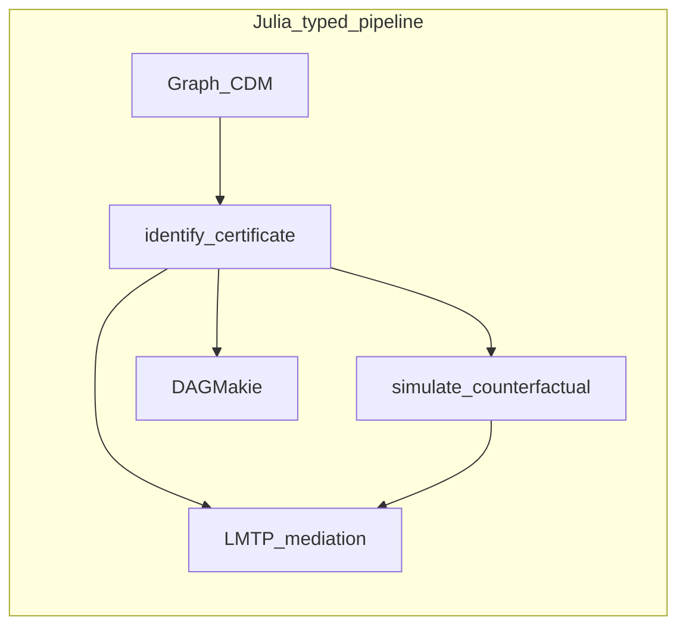

# How DAGMakie compares

DAGMakie.jl draws causal DAGs, mixed graphs, and related diagrams with Makie.
It is **visualisation only**: identification and estimation stay in
[CausalDynamics.jl](https://simonab.github.io/CausalDynamics.jl/dev/) /
[CausalInference.jl](https://github.com/mschauer/CausalInference.jl) and
[CausalTargeted.jl](https://simonab.github.io/CausalTargeted.jl/dev/).

Closest R tools are [ggdag](https://cran.r-project.org/package=ggdag) and
[dagitty](https://cran.r-project.org/package=dagitty) plots. In Python, people
typically glue networkx, matplotlib, graphviz, or
[CausalGraphicalModels](https://github.com/ijmbarr/causalgraphicalmodels).

**Choose DAGMakie when** you want layered causal themes, bidirected confounding,
path highlighting, time-indexed layouts, or SWIG / DiD visual grammar in the
same Makie stack as SciML and book figures.

**Prefer ggdag / dagitty when** your analysis is already tidyverse-centric, you
need the dagitty web GUI, or a one-off ggplot is enough.

Stack overview:
[ECOSYSTEM_COMPARISON.md](https://github.com/SimonAB/DAGMakie.jl/blob/main/ECOSYSTEM_COMPARISON.md).

## Legend

| Mark | Meaning |
|------|---------|
| `Yes` | First-class, documented |
| `Partial` | Possible with glue or a limited API |
| `—` | Not in that package’s usual scope |
| `Unique` | Strong differentiator here |

## Versus R and Python (DAG visualisation)

| Capability | DAGMakie | R | Python |
|------------|----------|---|--------|
| Layered causal DAG plot | Yes | Yes (ggdag, dagitty) | Partial (networkx / graphviz / CGMs) |
| Bidirected confounding arcs | Yes | Yes (ggdag / dagitty) | Partial |
| Path / adjustment / d-sep highlight | Yes (± CausalInference) | Yes (ggdag + dagitty) | Partial (DoWhy / CGMs) |
| Smart / dagitty-like ancestor colouring | Yes (`color_by=:ancestors`) | Yes (dagitty) | Partial |
| Display-only `do(·)` comparison figures | Yes | Partial (custom) | Partial (custom) |
| Time-indexed / unrolled layouts | Yes | Partial (custom ggplot) | Partial (custom) |
| SWIG / DiD / IDAG visual grammar | Unique | Partial (custom) | Partial (custom) |
| Same Makie stack as SciML figures | Unique | — | — |
| Graph GUI / interactive editor | — | Yes (dagitty web) | Partial |

## Julia neighbours

| Package | Role |
|---------|------|
| [GraphMakie.jl](https://github.com/MakieOrg/GraphMakie.jl) | General graph plotting backend |
| [CausalDynamics.jl](https://simonab.github.io/CausalDynamics.jl/dev/) | Identification sets consumed by plot helpers ([comparison](https://simonab.github.io/CausalDynamics.jl/dev/comparison/)) |
| [CausalTargeted.jl](https://simonab.github.io/CausalTargeted.jl/dev/) | Estimation (not plotted here) ([comparison](https://simonab.github.io/CausalTargeted.jl/dev/comparison/)) |

## What is distinctive here

- **Causal diagram defaults** — steel-blue themes, node roles, bidirected geometry
- **Visual grammar** — IDAG effect-measure nodes and DiD SWIG layouts
  ([guide](guide/visual_grammar.md))
- **Pipeline fit** — figures sit next to SciML and Documenter `@example` chunks
  without leaving Julia

## What is deliberately absent

Identification algorithms, estimation, and a dagitty-style GUI. Pass sets into
`dagplot_*`, or load CausalInference / CausalDynamics when the plot should
compute highlighting. See [Causal analysis](guide/causal.md).

The [CDCS book](https://simonab.github.io/causal-dynamics-book/) uses these
figures in narrative context.
